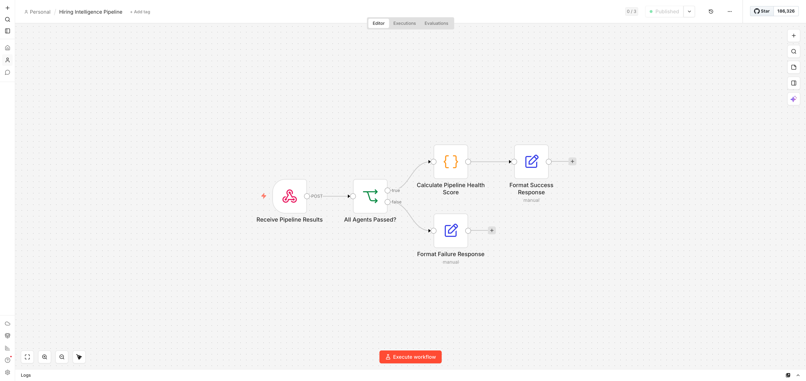
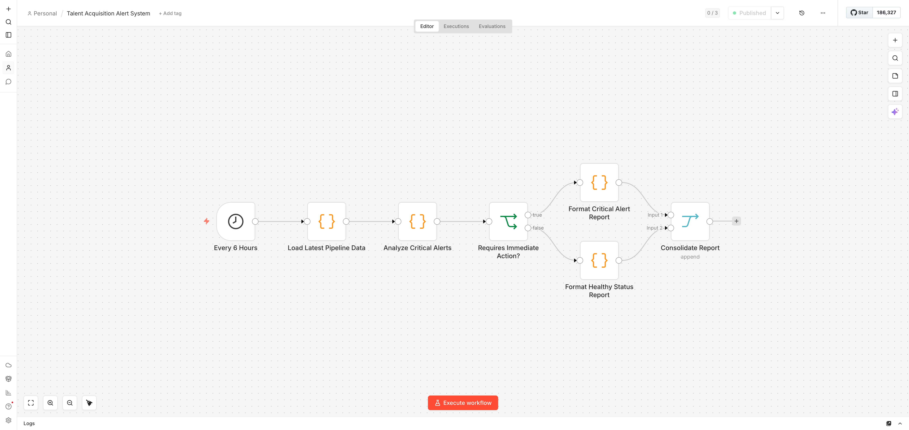

# AI-Powered Hiring Intelligence System

> Multi-agent AI pipeline for engineering talent acquisition insights.

**Author:** Lamonte Smith | Senior Software Design Release Engineer, General Motors  
**Program:** Interview Kickstart Applied Agentic AI - Capstone 2 | April 2026  
**GitHub:** [github.com/LSmithPMP](https://github.com/LSmithPMP)

---

## Architecture - Data Flow


---

## n8n Workflow Screenshots

### Workflow 1: Hiring Intelligence Pipeline


### Workflow 2: Talent Acquisition Alert System


---

## Problem Statement

Engineering managers and talent teams lack real-time visibility into hiring pipelines.
This system deploys 9 specialized AI agents delivering actionable insights in under 50 seconds for less than one cent per run.

---

## Tech Stack

| Layer | Technology |
|-------|------------|
| Agent Framework | LangChain |
| LLM Provider | OpenAI (gpt-4o-mini, gpt-4o) |
| Vector Store | ChromaDB |
| Orchestration | n8n Cloud |
| API Layer | FastAPI + Uvicorn |
| Dashboard | Streamlit |
| Data Contracts | Pydantic v2 |

---

## Agents (9 Total)

### Supporting Agents

| Agent | Autonomous | Role |
|-------|-----------|------|
| RoutingAgent | Yes | Selects gpt-4o-mini vs gpt-4o per task complexity |
| EvaluationAgent | No | LLM-as-judge quality gate |
| OptimizationAgent | Yes | Autonomous cost and threshold decisions |

### Insight Agents

| Agent | External Tools | Role |
|-------|--------------|------|
| SourcingQualityAgent | None | Channel conversion rates, cost per hire |
| RejectionPatternAgent | None | Stage bottlenecks, JD mismatch patterns |
| PanelLoadBalancerAgent | None | Interviewer overload detection |
| OfferInsightsAgent | None | Offer decline analysis, compensation gaps |
| PipelineHealthAgent | None | SLA breach analysis, velocity metrics |
| MarketIntelligenceAgent | Web Search API | Real-time market comp benchmarks |

### Shared Output Contract
Every agent returns: `recommendation` - `evidence` - `confidence_score` - `cost_of_insight` - `alternative`

---

## n8n Workflows

### Workflow 1: Hiring Intelligence Pipeline
- **Trigger:** POST webhook after every pipeline run
- **Nodes:** Receive Pipeline Results → All Agents Passed? → Calculate Pipeline Health Score → Format Success/Failure Response

### Workflow 2: Talent Acquisition Alert System
- **Trigger:** Scheduled every 6 hours
- **Nodes:** Every 6 Hours → Load Pipeline Data → Analyze Critical Alerts → Requires Action? → Format Report → Consolidate
- **Alert types:** SLA_BREACH (CRITICAL), OFFER_DECLINE (HIGH), MARKET_GAP (HIGH), LOW_CONFIDENCE (LOW)

---

## Performance Results

| Metric | Value |
|--------|-------|
| Agents passing | 7/7 (100%) |
| Eval score range | 0.60 to 0.97 |
| Cost per run (mixed) | $0.007404 |
| Latency | 25 to 46 seconds |
| Golden dataset | 75% pass rate (15/20) |
| n8n notification | 200 OK |

### Optimization Before vs After

| Lever | Before | After | Savings |
|-------|--------|-------|---------|
| Model routing | All gpt-4o ~$0.040/run | Mixed $0.007/run | ~83% |
| Few-shot prompts | PipelineHealth 0.60 | PipelineHealth 0.97 | +62% quality |

---

## Setup

```bash
pip install langchain langchain-openai langchain-community langchain-chroma
pip install chromadb streamlit pandas pydantic openai fastapi uvicorn python-dotenv requests
```

Create .env:
```
OPENAI_API_KEY=your_key_here
LANGSMITH_API_KEY=your_key_here
LANGSMITH_TRACING=true
```

```bash
python3 orchestrator.py
streamlit run dashboard/app.py
python3 api.py
```

---

## Documentation

- [Architecture Document](docs/IKCapstone2ArchitectureDocument_LSmith.docx)
- [Data Flow Diagram](docs/IKCapstone2_data_flow_diagram.png)
- [PRFAQ](docs/PRFAQ.md)
- [Security Risk Matrix](docs/IKCapstone2_SecurityRiskMatrix_LSmith.docx)

---

*Senior Software Design Release Engineer - General Motors Advanced Infotainment, Compute & Connectivity - Milford, MI*
